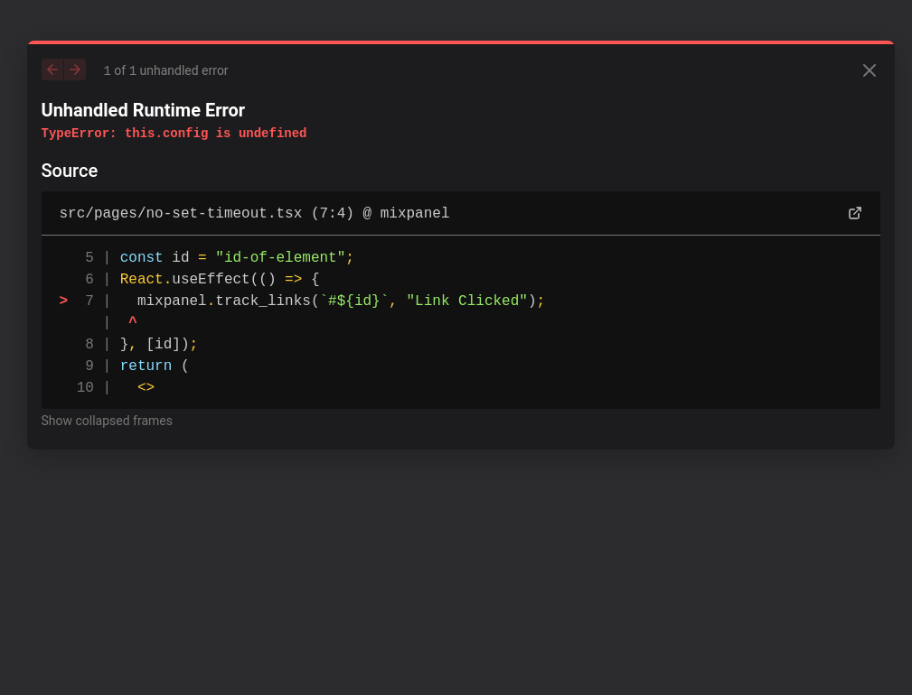

# Reproducing issue with Mixpanel tracking_links in a React app

## Issue

When using Mixpanel's `track_links` method in a React app, we need to wrap the method in a `useEffect` hook and a `setTimeout` to prevent errors like "this.config is not defined" or "cannot access property 'img' of undefined".

You can reproduce this by running `pnpm dev` and clicking on the link that says "Go to page demonstrating how it breaks without a setTimeout".
The index page does not break as it uses a `setTimeout` to wrap the `track_links` method, but the other page does break.
This does not work when using `ref`s either, as shown in the `using-refs.tsx` page.

Created to add a reproduction for issue https://github.com/mixpanel/mixpanel-js/issues/419#issue-2142437047

